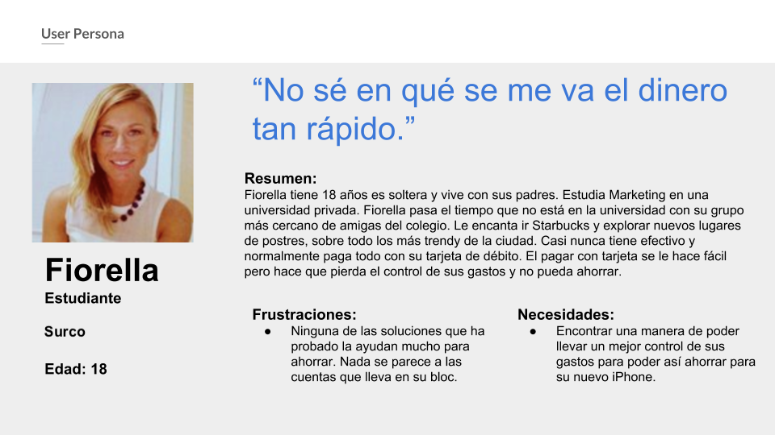
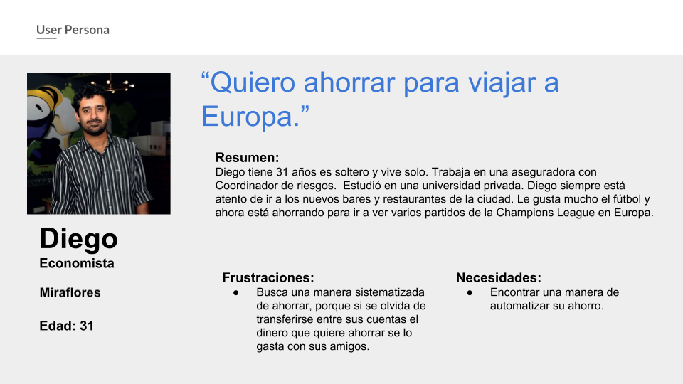
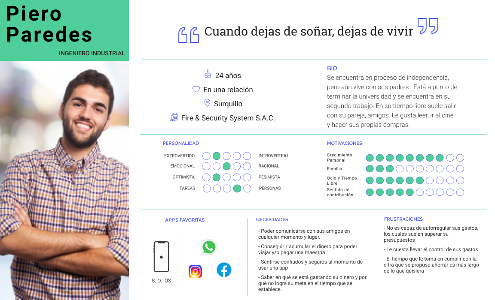
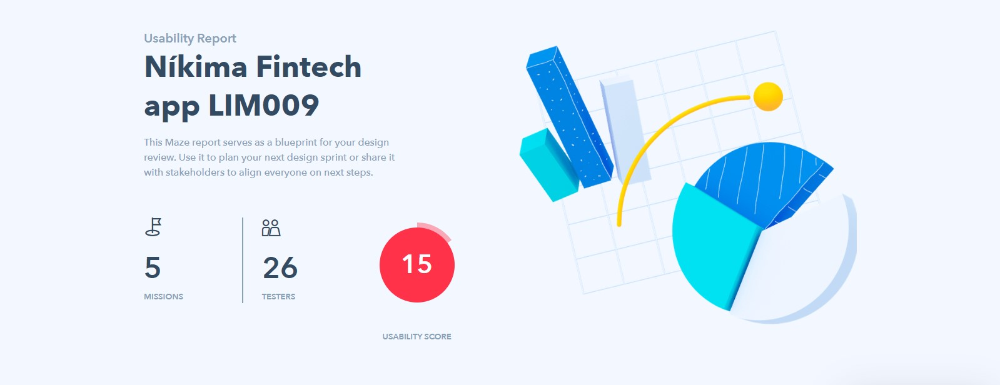
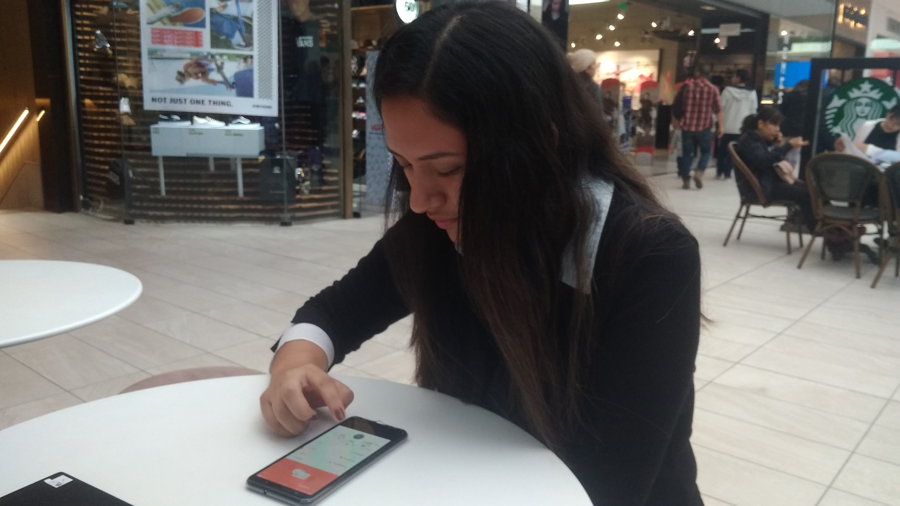
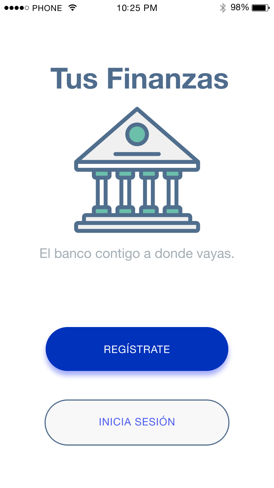
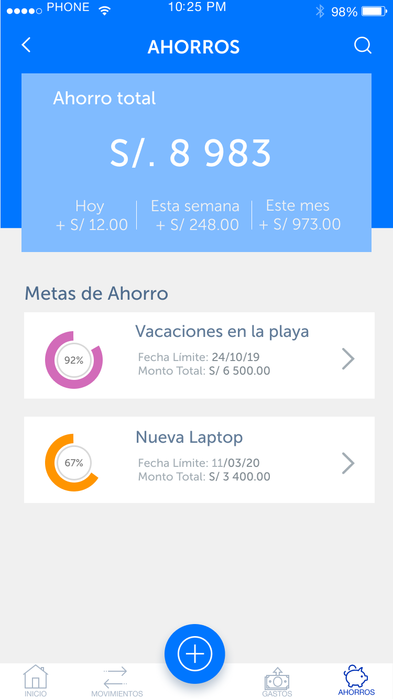

# Fintech App: **Tus Finanzas**

## Preámbulo
Todos tenemos en nuestras mentes una historia de éxito económico de alguien que surgió desde el polvo y hoy cuenta con numerosas propiedades, una lista de sueños cumplidos y una buena herencia para sus sucesores. Todos conocemos esas historias de esfuerzo arduo y de malos tiempos, que llevaron luego a esa persona y su familia a mejores épocas. Pero, además de la determinación, ¿qué hay en medio?
 
¿Todo tiene que ver con la economía? Suene triste y capitalista, así es. En un mundo donde trozos de papel equivalen anhelos humanos, todos trabajamos para acumular cuantos más papelitos podamos. Y he ahí lo que encontramos en medio: el ahorro. 

Un banco nacional es muy consciente de ello, por lo que se propuso desarrollar una aplicación llamada _Tus Finanzas_ que ayude a sus usuarios con el ahorro. Al cabo de 6 meses, con ansias de saber cómo direccionar su aplicación, nos brindan toda la información posible en busca de soluciones o mejoras que puedan implementar. 

## Objetivos iniciales del proyecto
*	Validar la investigación previamente hecha. 
* Testear la versión actual de Tus Finanzas.
*	Traducir la data. 
*	Presentar mejoras a la solución actual en base a las conclusiones de los anteriores. 

## Proceso de rediseño
#### Redefinición del user persona
Los perfiles que nos dio nuestro cliente, el banco, eran dos. La primera, Fiorella, recién ha cumplido la mayoría de edad y está muy familiarizada con la dependencia tecnológica.  Por otro lado, el segundo, Diego, es profesional e independiente, y está relacionado con la tecnología solo lo suficiente. En común tenemos que ambos vienen de una clase social media para arriba, son curiosos y sociables, y les gustaría ahorrar, pero no tienen el control sobre sus gastos.
Con el propósito de validar estos perfiles, hicimos 5 entrevistas a personas de 18 a 22 años, y otras 5 entrevistas a personas de 29 a 34 años, y estas entrevistas nos arrojaron perfiles con nuevas y adicionales características: el perfil de usuario más joven era inexperta en áreas financieras, y no tiene metas claras de ahorro, ya que el ahorro no es su mayor preocupación; adicionalmente, el segundo perfil es una persona instruida, con ansias de cubrir sus necesidades de autorrealización, por lo tanto tiene metas bien definidas y con ellas, una voluntad disciplinada para ver cumplidos sus objetivos. 

Con esta información nos atrevimos a entrevistar a personas fuera del rango de edad de los perfiles ya establecidos y nos llevamos la grata sorpresa que este era el perfil de persona ideal para la app. Este perfil se pudo determinar gracias al [Affinity Map ](https://miro.com/welcomeonboard/C8gCGyZazvv6omWxsRDrEvXzn1UF70HkMdaRakhTkZHznQc1HuZMz1MCdF6Mxx71) construido en Miro, una pizarra online para el trabajo colaborativo, donde no solo nació la información básica de Piero Paredes, sino también su personalidad, sus intereses, necesidades y frustraciones.

Piero Paredes es nuestro user persona. Él representa jóvenes de 23 a 27 años que estudian y trabajan por hacerse de sí mismos grandes profesionales y admirables seres humanos. Vive aún con sus padres; hogar que siempre ha cubierto sus necesidades, alimentado sus sueños y empujado a llegar a ellos.  No por carencias él ha decidido ahorrar, sino para pronto ser independiente e ir creciendo personalmente. También disfruta mucho la compañía de sus amigos y pareja, siendo bastante sociable, optimista y preocupado. Finalmente, Piero ha adoptado a su celular como una extensión de su mano. Le gusta todas las facilidades que le ofrece la tecnología y cómo optimiza su vida cotidiana, aún más en el ámbito financiero. No es completamente dependiente de las máquinas, pero es un gran oportunista. 

Hace un par de meses fue el cumpleaños del mejor amigo de Piero, por lo que decidieron salir a festejar a Mi Tercer Lugar Lima. Piero ya había destinado parte de su salario en el regalo para su amigo, comprarse una camisa nueva para la fecha y de lo que gastarían en su salida. Sin embargo, a la hora de la hora, la reunión en el bar se trasladó a una discoteca, donde el consumo de tragos y cerveza excedió su presupuesto. Piero no tuvo problemas con eso hasta la hora de depositar en su tarjeta de débito exclusiva para el ahorro ya que no tenía el monto que había decidido recibir homogéneamente cada mes. La preocupación de Piero era grande: A este paso no lograría mudarse el mes que él quería. 
Entonces, un día, atrapado en el tráfico limeño de las 7pm, Piero frustrado suspiró y se dijo “Si nunca logro controlar mis gastos, no podré ahorrar para mi departamento” y se dedicó a buscar apps que lo auxilien con su problema. En todas ellas encontró diferentes cosas que le gustaría ver en una sola app y además, deseó que trabajen con el banco del que él es usuario. Encontró, también, aplicaciones de otros bancos, pensando seriamente en apostar en algún otro para sus ahorros; pero sería una decisión que la tomaría después de una buena plática con la almohada. 

### Con respecto a la app
Paralelamente, se testeó virtual y presencialmente el prototipo de alta fidelidad, donde la herramienta de testeo virtual, Maze, nos arrojaba data de las áreas de mejora y el testeo presencial nos indicaba de forma más específica los puntos donde el usuario podía no tener una buena experiencia en la aplicación. Estos hallazgos se verían reflejados luego en la herramienta de análisis mental del cliente llamado [Customer Jouney Map](https://www.figma.com/file/dZtpM4MqqIQvzAmyRNAbtTWj/App-Financiera-Investigaci%C3%B3n.?node-id=3%3A114).

 

## Prototipo Navegable de Tus Finanzas
[Aquí puede interactuar con el prototipo navegable](https://marvelapp.com/i3563d4/screen/58248654)

 

